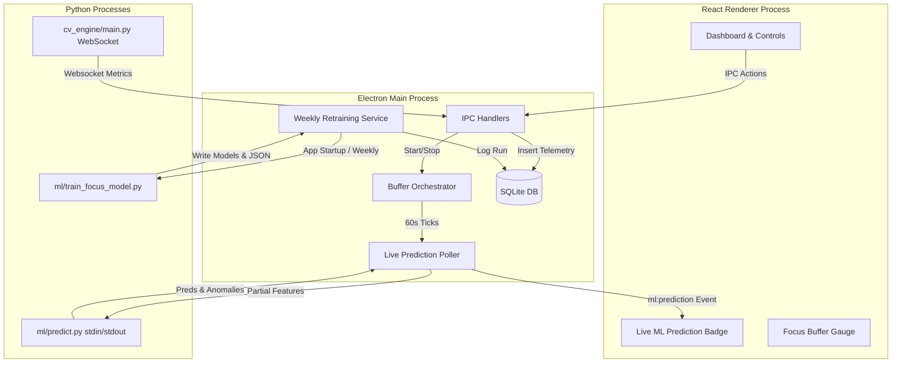

# System Architecture Guide

Focus Engine is a multi-language desktop productivity suite combining Electron/Node, React, and Python CV/ML systems.



---

## 1. Core Architecture Modules

### React Frontend (Renderer Process)
- Implements dashboard controls, timers (Pomodoro or Open-ended), telemetry breakdown grids, and visual focus indicators.
- Subscribes to backend telemetry streams (KPM, mouse, active window categories) and gaze status updates using the secure Electron preload bridge context.

### Electron Main Process (Node.js)
- Orchestrates overall app state, filesystems, background polling loops, and process spawns.
- Holds the **Buffer Orchestrator** which handles focus buffer calculations (decay and recovery algorithms) and coordinates live tracking.
- Contains the SQLite database (initialized locally on first boot).

### Python Computer Vision Subsystem (`python/cv_engine/`)
- Spawns as a dedicated subprocess on focus session start. Runs OpenCV camera frames through MediaPipe Face Mesh.
- Estimates eye-blink rate, head-pose rotations (yaw/pitch/roll), and gaze direction.
- Communicates continuously via local WebSockets (`127.0.0.1:port`) sending strictly derived numeric telemetry. **No raw video frames or photos ever leave the Python context or write to disk.**

---

## 2. SQLite Database Schema & Aggregation

The SQLite database stores all session details and telemetry metrics. Main schemas include:

- `sessions`: Real focus attempts storing parameters like start time, pause count, auto pauses, actual durations, and final focus scores. Purged of debugging sessions in Day 40.5.
- `cv_metrics`, `keyboard_metrics`, `mouse_metrics`, `window_focus`: Store tick-by-tick sensor metrics gathered during sessions.
- `buffer_snapshots`, `buffer_state_transitions`: Store the focus buffer historical value and warn/critical durations.
- `retrain_history`: A dated, append-only log recording ML retraining compositions, scores ($R^2$ and MAE), and deployment actions.

---

## 3. Machine Learning Pipeline

### Cold-Start Bootstrap Design
Because a new user lacks historical sessions to train a personalized machine learning model:
1. **Synthetic Pool Generation**: We seeded `synthetic_pool.csv` with 200 sessions generated from two behavioral archetypes:
   - *High-Focus Archetype*: High webcam attention, high focus buffer, low app switching, high continuous focus state.
   - *Low-Focus Archetype*: Low attention, decayed focus buffer, high app switches, frequent idle periods.
2. **Sliding Training Window**: The dataset is compiled by querying both real database records and the synthetic pool, ordering them by timestamp descending, and taking the **top 40 sessions**.
3. **Automatic Phasing-Out**: No manual rules or cutover logic are required. As the user completes actual sessions, they occupy the top slots of the descending sort, naturally displace and push out the oldest synthetic rows until the model is 100% trained on the user's personal behavioral habits.

### Weekly Retraining Loop & Deployment Gate
- Every time the application starts up, Node checks if 7+ days have elapsed since the last retraining run.
- If true, it runs the retraining sequence:
  1. `dataset_builder.py`: Extracts the sliding 40-row composition.
  2. `train_focus_model.py`: Trains a `RandomForestRegressor(n_estimators=100, max_depth=5)` to predict `focus_score`.
  3. `train_anomaly_model.py`: Trains an `IsolationForest(contamination=0.1)` on high-focus baseline samples to identify distraction spikes.
- **The Deployment Gate**: Before overwriting the active `focus_model.pkl` on disk, the script checks if the new candidate's 5-fold cross-validated $R^2$ score is greater than or equal to the deployed model's $R^2$. If yes, it deploys. Otherwise, it rolls back to keep the higher-performing model, logging the attempt details to `retrain_history`.

### On-Demand Prediction Engine
- To minimize memory consumption, Node does *not* run a persistent Python process for inference.
- Every 60 seconds during an active session, `livePredictionPoller.ts` aggregates in-progress session features, formats them as a JSON string, and spawns `predict.py`.
- `predict.py` reads the JSON string from standard input, maps keys matching `constants.py FEATURES` in exact column order, performs inference using the pickled models, and outputs `{"focusScore": 82, "isAnomaly": false}` to stdout before exiting immediately.
- If the prediction child process hangs, Node enforces a strict **5-second timeout** and terminates the task.

---

## 4. How to Test Retraining Manually

To verify the retraining engine without waiting 7 days, use one of the following methods:

### Method A: Execute via DevTools console
Open the Electron app in development mode (`npm run dev`), open the developer console (F12), and execute:
```javascript
window.focusEngineAPI.analytics.triggerRetrain().then(console.log).catch(console.error)
```
This bypasses the 7-day interval check, executes the pipeline synchronously, updates the database log, and returns the retraining status record.

### Method B: Reset settings key in database
To test the automatic app-launch check, set the last retrained timestamp to 0 in your SQLite settings table:
```bash
sqlite3 %APPDATA%/focus-engine-temp/focus-engine.db "UPDATE app_settings SET setting_value = '0' WHERE setting_key = 'last_retrain_time';"
```
Then restart the app. You will see retraining logs output to the terminal as the pipeline runs during initialization.

